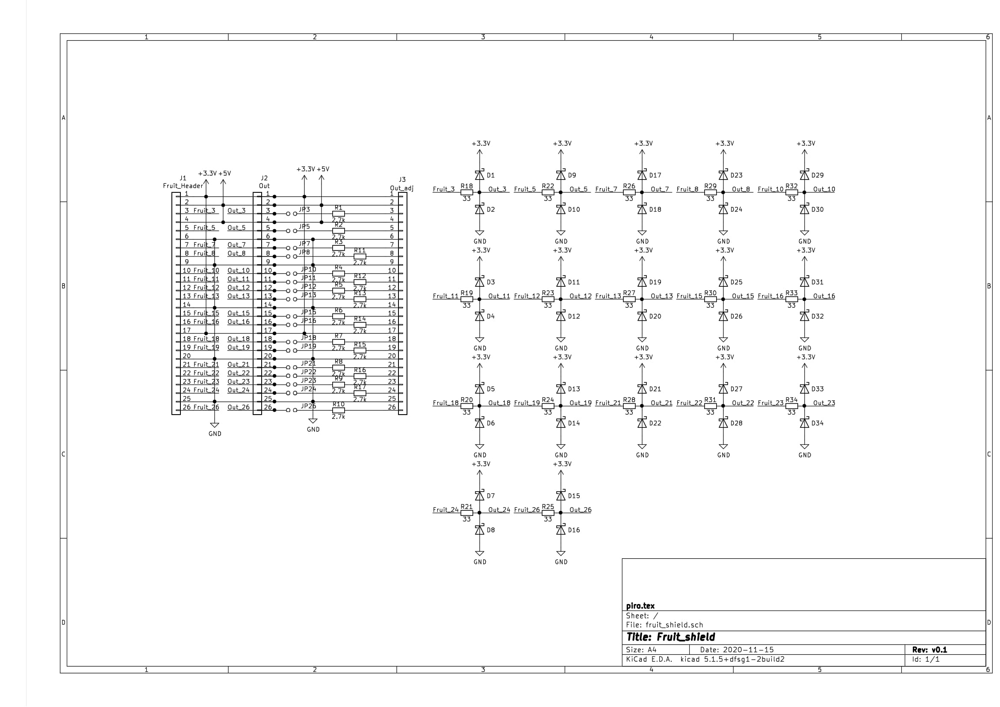
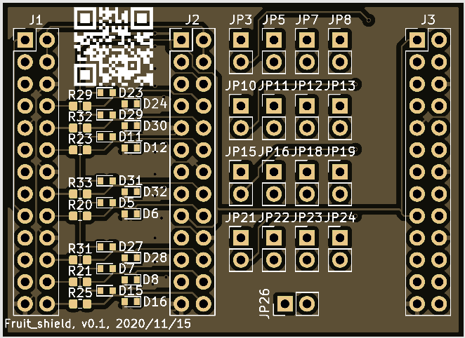
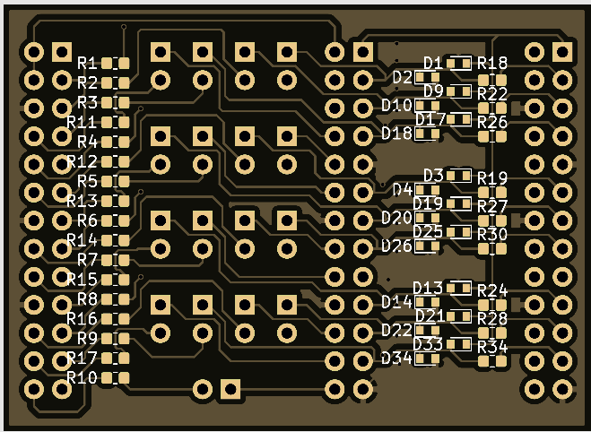

# fruit_shield
26 pin shield for Fruit SBC with logical level matching.
Version 0.1, just test.

## scheme:

## pcb:
### top:

### bottom:

## gerber:
Archive for production:
[gerber](https://github.com/piro-s/fruit_shield/raw/main/gerber/fruit_shield_v0.1_github.zip)